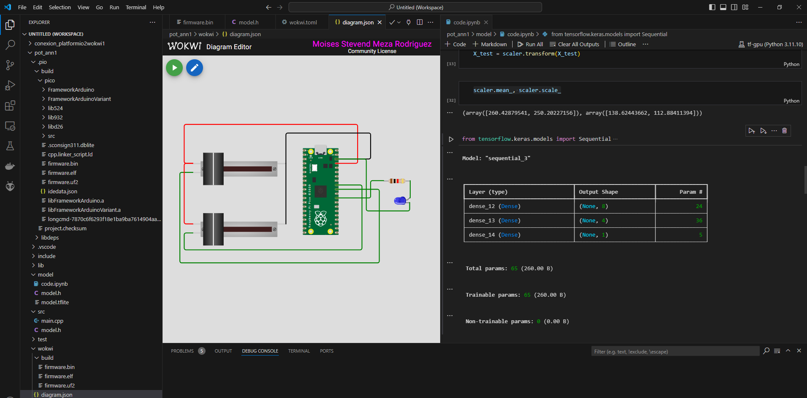

# pico_vscode_tflite
El proyecto busca simular un raspberry pi pico en VSCode con Wokwi para que infiera un model de TensorFlowLite creado en python.
La idea es que los desarrolladores tengan un sandbox para probar sus modelos de TFLite hechos antes de pasarlo a una tarjetas.
Se eligio la raspberry pi pico ya que cuenta con soporte para TFLite y tambien Wokwi cuenta con soporte para Raspberry pi pico, ESP32, STM-Nucleo. 
El repositorio contiene los códigos del proyecto.

- src: Contiene el código en arduino
- mode: Contiene el código en python y tensorflow
- wokwi: Contiene los archivos requeridos para simular el circuito

El proyecto necesita que VSCode tenga instalado los plugins de PLatformio y Wokwi, además de la Libreria para arduino *ArduTFLite*
Cabe resaltar que se esta usando una cuenta FREE de wokwi, por lo que la licencia de uso solo tiene una duración de 30 dias.
En la carpeta de Wokwi existe un archivo llamado *diagram.json* que Wokwi no deja modificar, ya que alli va la estructura de la circuiteria, por lo que
debes crear la circuiteria en la página de Wokwi luego copias su archivo .json y lo pegas en *diagram.json* de su proyecto en VScode.

Imágen del resultado final:

